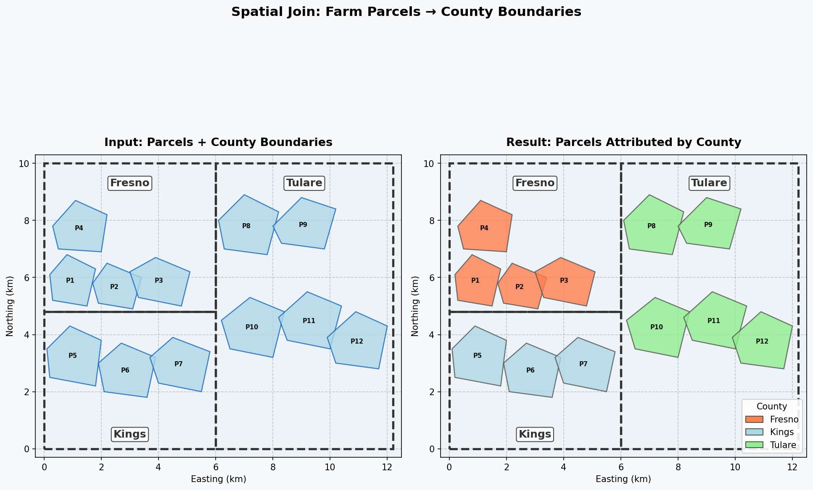
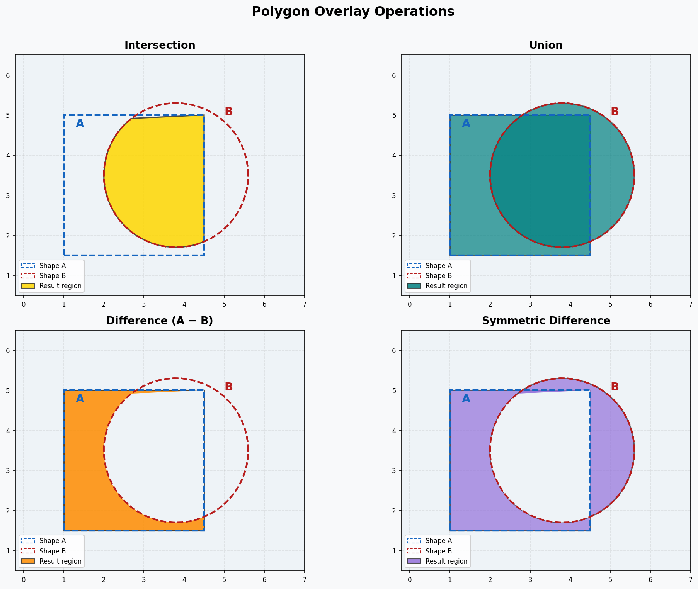
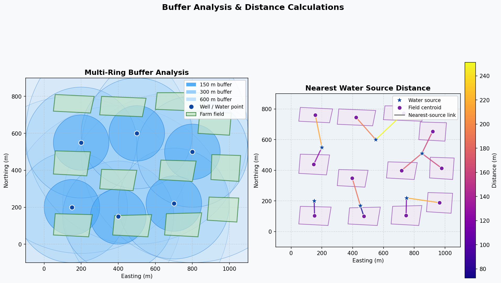
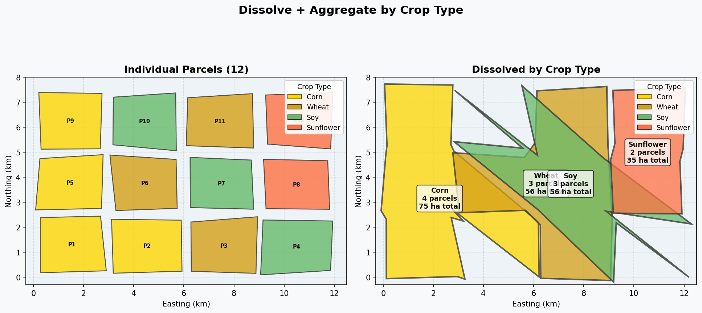

# Spatial Analysis with GeoPandas
**Author:** Emmanuel Oyekanlu — Principal Data Engineer  
**Focus:** Real-world spatial analysis for precision agriculture and data pipeline integration

---

## Visual Gallery

The images below are generated directly from this repository's code using only `matplotlib` and `numpy`.

### Spatial Join — Fields to County Boundaries
Point-in-polygon spatial join: field centroids assigned to county polygons via `gpd.sjoin()`, with a choropleth colouring each county by field count.



### Overlay Operations (Union, Intersection, Difference, Sym. Diff.)
Four set-theoretic polygon overlay operations on agricultural field layers, demonstrating the `overlay()` method.



### Buffer & Distance Analysis
Left: point, line, and polygon buffer zones around irrigation infrastructure. Right: distance matrix heatmap between farm locations.



### Dissolve & Zonal Aggregation
`dissolve()` merging field polygons by crop type with `aggfunc='sum'` on area — equivalent to a spatial GROUP BY.



---

## Overview

This repository demonstrates production-grade spatial analysis using GeoPandas — the primary Python library for vector geospatial data analysis. Every script is designed to solve problems that arise in real agricultural data engineering workflows: joining field data to administrative boundaries, analyzing flood risk overlaps, computing buffer zones around irrigation infrastructure, building distance matrices for logistics optimization, and generating zonal statistics from simulated raster data.

---

## Spatial Analysis Concepts

### Spatial Joins
A spatial join combines attributes from two layers based on their geometric relationship. Unlike a tabular join (matching on a key column), a spatial join matches records based on whether geometries intersect, contain, are within, or touch each other.

**Types:**
- **Point-in-polygon:** Assign county/district attributes to each field centroid
- **Polygon-to-polygon (intersects):** Find all county polygons that overlap each field
- **Within:** Find all fields completely contained within a buffer zone

### Overlays
Overlay operations perform set-theoretic operations on polygon layers:
- **Union:** Combine two layers, splitting polygons where they overlap
- **Intersection:** Keep only areas present in both layers
- **Difference:** Remove from layer A the areas covered by layer B
- **Symmetric Difference:** Keep areas in either layer but not both

### Buffers
A buffer creates a zone of a specified distance around a geometry:
- Point buffer: circular zone around a well or sensor location
- Line buffer: corridor around an irrigation canal or road
- Polygon buffer: expanded boundary around a field (positive) or interior setback (negative)

### Distance & Nearest Neighbor
- **Distance matrix:** All pairwise distances between a set of features
- **Nearest neighbor:** For each feature, find the closest feature in another layer
- **Network distance:** Distance following a road/canal network (requires networkx)

### Dissolve & Aggregate
Dissolve merges geometries sharing the same attribute value, reducing many polygons to fewer. Combined with `aggfunc`, it computes statistics (sum, mean, count) per group — equivalent to a SQL GROUP BY with spatial union.

### Zonal Statistics
Zonal statistics summarize raster values within vector polygon zones. Classic use: compute mean NDVI or mean soil temperature per field from a satellite image grid.

---

## Real-World Applications in Precision Agriculture

### Field Management Zones
- Join yield data points to field polygons to identify high/low performing zones
- Buffer analysis to enforce pesticide application setbacks from water bodies
- Overlay crop insurance zones with field boundaries to compute eligible area

### Supply Chain and Logistics
- Distance matrix between farm locations and processing facilities for route optimization
- Buffer zones around access roads to identify fields reachable by heavy machinery
- Overlay flooded areas (from remote sensing) with crop fields to assess crop loss

### Regulatory Compliance
- Intersect field boundaries with Environmental Quality Incentive Program (EQIP) eligibility zones
- Find fields within Chesapeake Bay Critical Areas (buffer from water bodies)
- Overlay field polygons with USDA crop reporting districts

### AGV/AMR Integration
- Buffer safety exclusion zones around obstacles to generate navigable paths
- Spatial join between waypoints and field zones for autonomous task assignment
- Distance matrix between charging stations and work zones for battery management

---

## Data Pipeline Integration

In a large-scale agricultural data engineering pipeline, these spatial operations slot into specific pipeline stages:

```
Raw Sensor Data → Ingestion → Spatial Enrichment → Feature Store → ML Models
                                    ↑
                           GeoPandas operations:
                           - spatial_join (field attribution)
                           - buffer (zone creation)
                           - overlay (risk intersection)
                           - dissolve (rollup aggregation)
```

The GeoPandas GeoDataFrame integrates with:
- **Apache Spark:** via sedona (GeoDataFrame → Spark DataFrame)
- **PostGIS:** via GeoAlchemy2 + SQLAlchemy
- **Delta Lake:** serialize geometries as WKT/WKB columns
- **Apache Parquet:** with WKB geometry encoding

---

## Repository Structure

```
05_spatial_analysis_geopandas/
├── README.md
├── requirements.txt
├── .gitignore
├── 01_spatial_joins.py          # Left joins, polygon-in-polygon, field-county
├── 02_overlay_operations.py     # Union, intersection, difference, sym_diff
├── 03_buffer_analysis.py        # Well and canal buffers, dissolve, within test
├── 04_distance_and_nearest.py   # Distance matrix, nearest neighbor
├── 05_dissolve_and_aggregate.py # Dissolve by crop type, area/yield stats
├── 06_zonal_statistics.py       # Simulated raster zonal stats per polygon
└── data/
    ├── farm_parcels.geojson     # 12 Central Valley CA polygons
    ├── water_sources.geojson    # 6 wells/ponds/canal points
    └── counties.geojson         # 3 county polygons
```

---

## Setup & Usage

```bash
python -m venv venv
source venv/bin/activate  # Windows: venv\Scripts\activate
pip install -r requirements.txt

# Run each script independently
python 01_spatial_joins.py
python 02_overlay_operations.py
python 03_buffer_analysis.py
python 04_distance_and_nearest.py
python 05_dissolve_and_aggregate.py
python 06_zonal_statistics.py
```

---

## Key GeoPandas Patterns

### Spatial Join
```python
import geopandas as gpd

fields = gpd.read_file("data/farm_parcels.geojson")
counties = gpd.read_file("data/counties.geojson")

# Join county attributes to each field
joined = gpd.sjoin(fields, counties, how="left", predicate="within")
print(joined.groupby("county_name")["area_ha"].sum())
```

### Buffer
```python
wells = gpd.read_file("data/water_sources.geojson")
wells_projected = wells.to_crs("EPSG:32610")  # Project for metric buffer
buffer_300m = wells_projected.buffer(300)      # 300 meter radius
```

### Overlay
```python
result = gpd.overlay(farm_parcels, flood_zones, how="intersection")
```

### Dissolve
```python
dissolved = fields.dissolve(by="crop_type", aggfunc={"area_ha": "sum", "yield_ton_ha": "mean"})
```

---

*Part of the Geospatial Data Engineering portfolio by Emmanuel Oyekanlu.*
